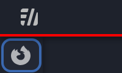

> A modular UI customization for Firefox, removing borders in the favor of shadows to emphasize the layer elevation.\
> Sidebery is used for the vertical tabs.

## Install

1. Set Firefox theme to `Dark` in: Firefox settings > Extensions & Themes > Themes.
2. Vertical tabs *(Optional, see [Customization](#Customization))*:
    * Install the [Sidebery extension](https://addons.mozilla.org/en-US/firefox/addon/sidebery/).
    * Go to Sidebery settings (right-click extension) > Help > Import addon data > Choose file `sidebery/settings.json`.
    * *(Optional)* For tab previews: Sidebery settings > Search for "Tabs preview" > Enable and grant permissions.
3. Go to `about:config` (in the URL bar) and set `toolkit.legacyUserProfileCustomizations.stylesheets = true`.
4. Go to `about:support` > Search for "Profile Directory" > Open > Copy the "chrome" folder to this location.
5. Restart Firefox.

## Uninstall

Set `toolkit.legacyUserProfileCustomizations.stylesheets = false` or delete the `chrome` folder from the profile.\
For Sidebery: Sidebery settings > Help > Reset settings.

## Customization

* It's recommended that additions or updates of the default styles to be done in the following files (which should be created by you). This way, your local changes will persist when this repository is updated.
    * `chrome/DownToneUI/override_chrome.css` for changes to `chrome/userChrome.css`
    * `chrome/DownToneUI/override_content.css` for changes to `chrome/userContent.css`
* For normal (horizontal) tabs:
    * In file `chrome/userChrome.css` remove the line `@import "DownToneUI/sidebar.css";`.
* Changing the color scheme:
    * This can be done in `chrome/DownToneUI/_globals.css` by modifying the `--dtui-theme` variables.
    * **NOTE:** if vertical tabs are used, these changes also have to be applied to: Sidebery settings > Style editor.
* See [addons](addons/) for some modifications of the defaults. The content of these files is intended to be copied as follows:
    * `chrome_` files to `chrome/DownToneUI/override_chrome.css`
    * `content_` files to `chrome/DownToneUI/override_content.css`
    * `sidbery_` files to Sidebery's Style editor (at the end)

## Notes

* The bookmarks bar inner height varies based on the font you use and maybe other factors (like scaling). To get the correct height, some trial & error might be needed.
    * First, copy the contents of `addons/chrome_debug_bookmarks_height.css.css` to your `chrome/DownToneUI/override_chrome.css`
    * Decrease the value of `--dtui-ui-bookmarks-inner-height` in `chrome/DownToneUI/_globals.css` until the red background is visible. (Firefox restart is needed after every change)

        
    * Set it to the value where the red background is NOT visible.
* To open the sidebar tabs (in case you've gone to History or entered Private Mode): click on the Sidebery extension or use shortcut CTRL+E (shortcut is not working in Windows).

## Credits

* Contributors to the [firefox-csshacks](https://github.com/MrOtherGuy/firefox-csshacks) repository and [Zen Browser](https://zen-browser.app) for some ideas.
* Community on [/r/FirefoxCSS](https://www.reddit.com/r/FirefoxCSS/) for the various snippets of information.
